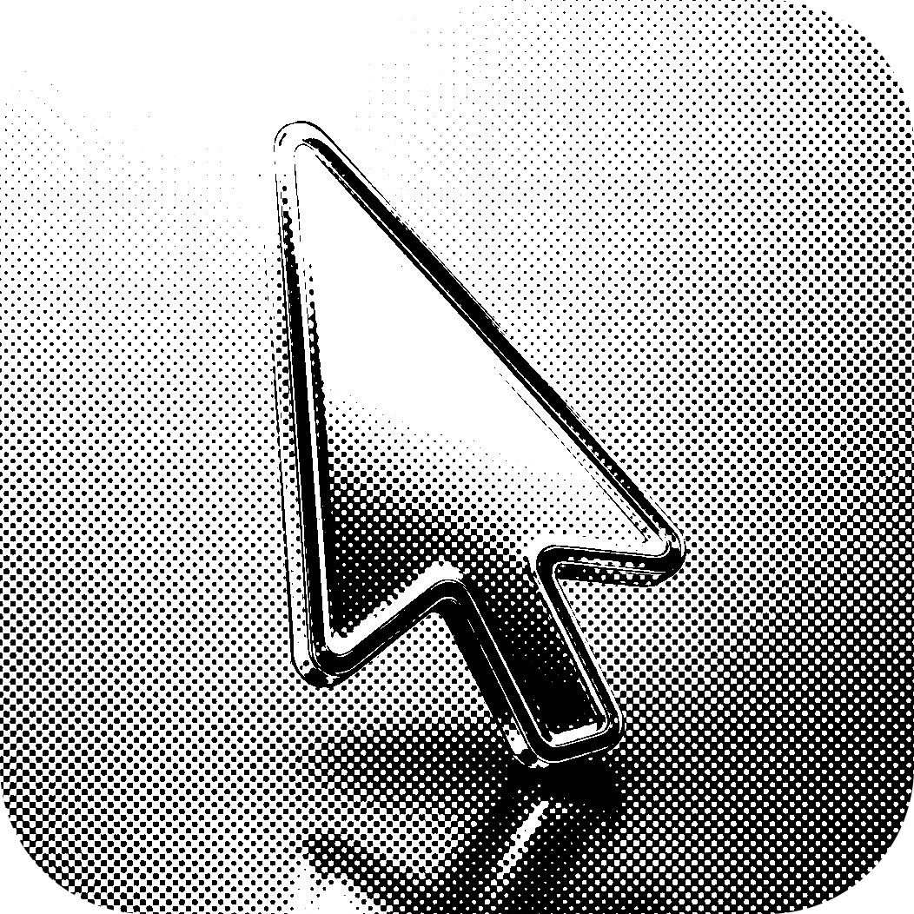

<p align="center">
  
</p>

<h1 align="center">mousee</h1>

Turn your phone into an air-mouse / laser pointer for your PC. The phone's
browser streams device-orientation data over a WebSocket to a small Rust daemon
on the PC, which moves the system cursor.

- **Client** — a single self-contained HTML file (`client/index.html`), embedded
  into the binary at build time via `include_str!`.
- **Server** — one Rust binary (`mousee`). No external runtime, no system OpenSSL.

## Build

Requires a Rust toolchain (stable). On Windows install via
[rustup](https://rustup.rs).

```powershell
cargo build --release
```

The release binary is `target/release/mousee(.exe)`. It is fully self-contained —
the HTML client is baked in.

## Run

```powershell
cargo run                    # debug: foreground logs, no tray, Ctrl-C stops all
cargo run --release          # interactive: pick interface, prints a QR code
.\target\release\mousee.exe  # same, from the built binary
```

On start the server:

1. reads the monitor layout and computes the virtual desktop (logged);
2. lets you pick the network interface (arrow keys, recommended one preselected);
3. generates/loads a stable local root CA plus a CA-signed TLS certificate for
   the current LAN addresses (cached in the per-user data dir —
   `%LOCALAPPDATA%\mousee` on Windows, `$XDG_DATA_HOME`/`$HOME` elsewhere);
4. binds `0.0.0.0:<port>` for **both** the page and the WebSocket;
5. prints a QR code with `https://<ip>:<port>`.

Scan the QR with your phone. Before the root CA is installed, Safari will show a
local-certificate warning; the page then connects on its own (no address to
type), and you just **pick a mode**. On iOS the first mode tap is what grants
motion-sensor access.

Safari's “visit this website” exception is temporary. For permanent local trust,
expand **iPhone keeps showing certificate warnings?** on the mode screen,
download the stable `mousee local root CA`, install it under **Settings → General
→ VPN & Device Management**, then enable it under **General → About → Certificate
Trust Settings**. Install this root only from your own PC. The CA remains stable
when mousee renews an IP certificate or the LAN address changes.

### Flags

| Flag | Effect |
|---|---|
| `--ip <IPV4>` | Force the advertised LAN-IP, skip the picker. |
| `--port <N>` | Port for page + WebSocket (default `8081`). |
| `--yes` / `--no-tui` | Headless: use the recommended/forced IP, no picker, no tray. |
| `--no-tls` | Serve plain HTTP (⚠ iOS will **not** grant sensors). |
| `--no-tray` | Don't show the tray icon; run in the foreground until Ctrl-C. |
| `--debug` | Verbose sensor/mapping logs and foreground mode (no tray). |

## System tray & background (Windows)

Release builds use two processes so closing the launcher does not kill the tray
application:

1. The **launcher** (this console) picks the interface, prints the QR, then
   spawns…
2. a **detached, console-less background worker** that runs the server and the
   tray icon.

That means you can **close the launcher console with the X** and the app keeps
running in the tray — exactly like a normal background app. The QR and URL stay
visible in the launcher console until you close it. Quit from the tray icon →
**Quit**.

Tray menu:

- a header showing the current `IP:port`,
- **Quit**.

The tooltip switches between "waiting for phone" and "phone connected".

The background worker has no console of its own and so emits **no logs**: logging
is foreground-only. A normal `cargo run` (debug profile) automatically stays in
the foreground, enables throttled raw/derived coordinate logs, creates no tray
icon, and exits the whole application on Ctrl-C. For a release binary, use
`--debug` or `--no-tray` to get foreground behavior.
Build without it via `cargo build --release --no-default-features` (or run with
`--no-tray`).

On an interactive release launch, mousee also asks whether it should start when
you sign in to Windows. The default is **No, not now**; you can permanently hide
the question or add the current executable to the per-user Windows autostart
entry (no administrator rights required).

## Modes

- **Air Mouse (relative)** — recommended, no calibration. Aim to move; movement is
  by orientation *delta* per frame with a dead zone + acceleration curve.
- **Absolute** — aim maps directly to the screen after a 4-corner calibration.
  Horizontal spans the whole virtual desktop; vertical is stretched over the real
  monitor under the pointer (no dead zones on mixed-height multi-monitor setups).
Smoothing is always active in both modes. The phone slider shows the actual
amount of smoothing: right is steadier, left is more responsive. Its default
65% maps to the existing internal response of 0.35.

## Gestures (control screen)

- **Tap** — click (left half = LMB, right half = RMB).
- **Hold still, then aim** — presses & holds the button for drag/select.
- **Swipe** — scroll wheel (TikTok-style).

## Tuning

All knobs are explicit constants at the top of the files:

- Server: [`src/config.rs`](./src/config.rs).
- Client: the `CFG` object and `:root` CSS vars in
  [`client/index.html`](./client/index.html).

## Notes / known limitations

- **Linux/Wayland:** input injection (`enigo`) is restricted under Wayland; X11
  works. Primary target is Windows. The tray (`tray-icon` + `tao`) is also best
  tested on Windows; disable with `--no-default-features` if it fails to build.
- Relative mode uses consecutive `DeviceOrientationEvent` alpha/beta deltas.
  Gamma is logged for diagnostics but does not move, suppress, or recalibrate
  the cursor. Large frame deltas pass through a direction-preserving `asinh`
  compressor, followed by a 1€ filter.
- Absolute horizontal can still inherit compass/magnetometer drift and therefore
  needs calibration.
